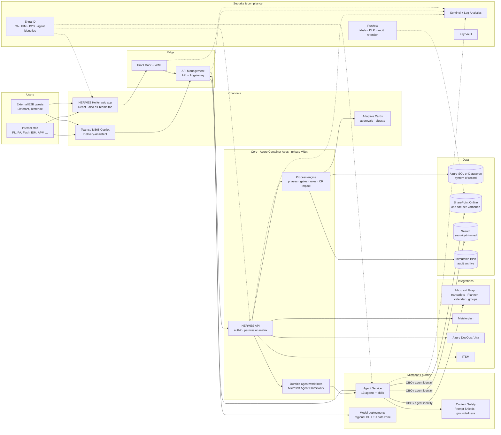
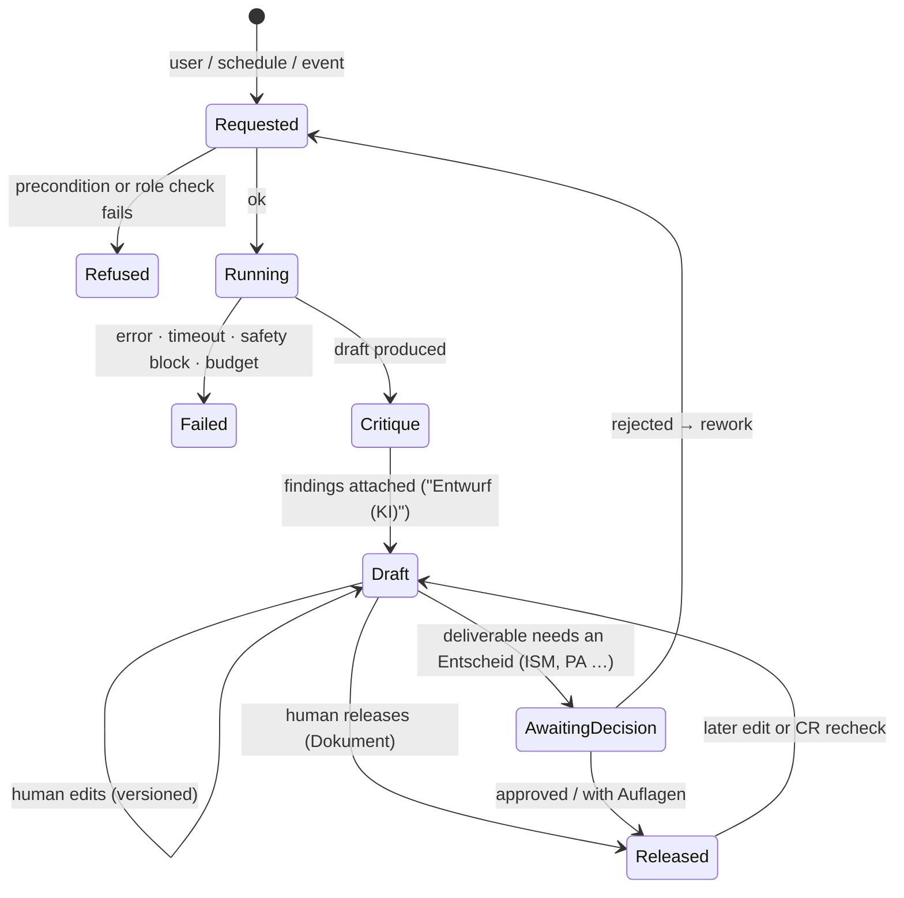

# HERMES Helfer: target architecture and agent design

| | |
|---|---|
| Status | Draft v0.1, for discussion |
| Basis | Prototype v22 (`HERMES-Helfer_Prototyp_v22.html`) |
| Platform | Microsoft Entra ID, SharePoint Online, Microsoft 365, Azure, Microsoft Foundry |
| Date | 2026-10-08 |

The open questions in [section 11](#11-open-questions) block several decisions in this document. Every retention period, region and licence assumption below is a proposal until those questions are answered.

---

## 1. Summary

- **The prototype names about 60 "agents".** It has 42 phase agents, 10 background checks and 8 global or event agents, plus a feedback agent. Production should not run 60 LLM agents. They fall into four kinds: rule and state logic, document drafting, reviewing and monitoring, and integrations with existing systems.
- **Proposed target: a deterministic HERMES process engine, 13 AI agents with one skill per deliverable, and connectors.** The UI can still show the HERMES-specific names ("Pattern-Pilot", "Go-live-Check"), because those become skills of fewer runtime agents.
- **AI drafts and humans decide, and the code enforces this.** Approving, releasing, passing a gate, deciding a CR and marking something as not applicable are not available to agents as tools. The prototype only says so in a prompt ("Entscheide triffst du nie selbst"). That is not enough for production.
- **Interactive agents act on behalf of the signed-in user (OBO).** They only see what that person may see. Background agents have their own least-privilege identity, scoped per project.
- **Logs go into three separate streams:** a tamper-evident business audit trail (the "Projektakte"), an AI run audit, and platform and security telemetry in Microsoft Sentinel.
- **The app has to pass its own Pattern-Pilot.** The 12 architecture patterns in the prototype (WAF/API gateway, central logging, CH/EWR data, IAM, WCAG 2.1 AA, pentest before go-live and so on) apply to the HERMES Helfer itself. It is also a HERMES project with its own SchuBAn, ISDS-Konzept and DSFA.

---

## 2. What the prototype contains

| Area | What the prototype does | Where it lives in production |
|---|---|---|
| Identity and roles | Entra sign-in. Groups `SG-PRJ-<CODE>-<ROLE>` map to 10 roles, which map to 5 views (PL/BC, Leitung, Fach, Querschnitt, Lieferant). B2B guests for external people. | Entra ID and app authorization (§6) |
| Phases and deliverables | 5 phases (Skalierung is an extension), 48 deliverables (pflicht/situativ). Status runs open → Entwurf (KI) → approval/veto → done. "Nicht zutreffend" needs a reason. | Engine |
| Gates and decisions | One gate per phase with a named decider. Outcomes: freigegeben / mit Auflagen / zurückgewiesen. PA decisions need Konsent. Auflagen have an owner and a due date. ISDS and Go-live have a veto. | Engine and approval workflow |
| Beteiligung | A Vorhabensprofil with 8 attributes drives rules that make roles mandatory per phase. The gate stays closed until those roles are involved. | Engine (rules) |
| Change Requests | Register with impact in 8 dimensions (budget against reserve, schedule, architecture, security/DS, tests, training, operations, acceptance) and a PA decision. A CR that touches data forces ISM and FDS to recheck SchuBAn, ISDS and DSFA. | Engine computes the impact. AI detects and drafts. |
| Besprechungen | Turns a transcript into decisions, tasks with owner and due date, and open questions. Mirrors the result back to the Fachstelle for confirmation. | AI (Protokoll) and Microsoft Graph |
| Ablage | Indexes 6 repositories, including supplier systems. Detects duplicates. Offers "Wo finde ich …" search and a contact directory. | SharePoint, search, AI (Wissen) |
| Systemskizze and Pattern-Pilot | 12 patterns, deviations per project, a versioned sketch | AI (Architektur) and the EA pattern catalogue |
| Reifegrad | 8 artifacts × 6 maturity levels, with a target per phase. A recheck demotes the level. | Engine |
| Go-live and Readiness | 7 go-live criteria with a veto for Fachstelle and APM. An ordered infrastructure sequence. Access tests that need evidence. | Engine checklists and evidence upload |
| Risks, Statusbericht, Kommunikation | Risk register, HERMES status report with a 6-criterion Ampel, messages per audience and format | Engine data and AI drafting |
| Background checks | 10 agents that run on change or on a schedule, each with run logs | Mixed (Appendix A) |
| Delivery-Assistent | Regex intent routing, an LLM fallback over project JSON with a `start_agent` tool, and Autopilot | AI orchestrator (§5.4) |
| Verlauf | Activity feed with actor and channel | User-facing view of the audit trail (§8) |
| Feedback | Interview with AI follow-up questions, voice input, Microsoft Forms fallback | Pilot only |

---

## 3. Design principles

1. **The engine owns the truth and the AI drafts.** Phases, deliverable status, gate state, participation rules, CR impact figures, maturity levels and go-live criteria are deterministic code. The process logic in the prototype (`gateState`, `delivStatus`, `partsFor`, `crImpact`, `maturity`) is already deterministic and should stay that way.
2. **No agent can decide.** Decisions are API operations that need a human user token with the right role for that project (§5.2). Agents can only create proposals: drafts, findings, task proposals, CR proposals and risk proposals.
3. **Interactive work runs as the user.** The orchestrator and drafting agents call SharePoint and Graph with the user's delegated token. They are security-trimmed automatically. A Lieferant's chat can never pull ISDS content.
4. **Every AI output carries its provenance:** the sources (document and version), the agent and prompt version, the model deployment and the Kritiker findings. It stays "Entwurf (KI)" in SharePoint metadata and as a document watermark until a named person releases it. The prototype's rule that editing a released result sets it back to Entwurf stays.
5. **HERMES is configuration, not code.** Phases, deliverables, skills, rules, patterns, roles and the permission matrix are versioned configuration owned by the PMO. A new edition of the PM-Handbuch should not need a code release.
6. **Untrusted content is data, never instructions.** That covers supplier documents, emails, meeting transcripts and uploads (§7.2).
7. **Dogfooding.** The HERMES Helfer project runs through HERMES and through the HERMES Helfer.

---

## 4. Reference architecture



| Layer | Recommendation | Notes |
|---|---|---|
| UI | React SPA (Fluent UI 2), ported from the prototype UX, also published as a Teams tab | Use the prototype as the UX and domain specification. Do not use it as the code base: it overrides functions several times (v20 and v22 replace earlier declarations) and builds the page with `innerHTML`. |
| Conversational channel | Delivery-Assistent in Teams and Microsoft 365 Copilot through the Microsoft 365 Agents SDK, or as a declarative agent with an API plugin | One back end serves both the web app chat panel and Teams. |
| API and engine | .NET or TypeScript services on Azure Container Apps (container delivery, as pattern 2 requires) | Stateless API, engine as a domain library, events through Service Bus |
| Agent workflows | Microsoft Agent Framework workflows, or Durable Functions, with checkpoints and human-in-the-loop pauses | Agent runs take minutes, wait for people and must survive restarts. |
| Agents | Microsoft Foundry Agent Service (formerly Azure AI Foundry): agents, connected agents, tracing, evaluations | One agent definition per agent in §5, versioned in Git |
| System of record | **Azure SQL** for the pro-code route, **Dataverse** for the low-code route (§4.1) | Not SharePoint lists: they have weak relational integrity and auditing, and list view thresholds cause problems. |
| Documents | SharePoint Online, one site per Vorhaben, provisioned from a template with the HERMES folder structure (`05_Projektstatusberichte`, `08_Projektausschuss_Projektentscheide` …) | Sensitivity label per library, derived from the Datenklassifizierung |
| Search / RAG | Graph and SharePoint retrieval with the user's token (trimmed by design). Azure AI Search with ACL fields only where custom chunking is needed. | Copilot connectors (for example Confluence) only if the supplier has agreed (§9) |
| Approvals | In-app decisions with Adaptive Card notifications in Teams and Outlook | The decision is recorded by the engine, not by the card service, so the audit trail stays in one place. |
| Model access | Every model call goes through APIM as an AI gateway | Token quotas per agent and project, logging, failover, one control point |

### 4.1 Pro-code or low-code

| | A. Copilot Studio + Power Platform | B. Pro-code on Azure + Foundry |
|---|---|---|
| Time to a first pilot | Fastest | Medium |
| Fidelity to the prototype UX | Limited (canvas or model-driven app) | Full |
| Complex state machine (gates, vetoes, rechecks, maturity) | Possible, but hard to test and version | Natural: unit-testable domain code |
| ALM, CI/CD, evaluations before release | Solutions and pipelines exist, but are weaker | Full Git, PR review and evaluation gates |
| Audit and tamper evidence | Dataverse auditing is good but not tamper-evident | Hash chain and WORM archive (§8) |
| Skills needed | Power Platform makers | Developers (React plus .NET or TypeScript) |

**Recommendation:** B for the engine, the web app and the agents. The Delivery-Assistent can still reach Teams and M365 Copilot through the Agents SDK. Choose A only if no developer team is available. The answer depends on question 5 in §11.

### 4.2 Model layer

- **Route by task.** A small, fast model handles intent detection, classification and follow-up questions. A strong reasoning model drafts and critiques. An embedding model serves search.
- **Data residency.** Use *regional* deployments (Standard or Provisioned) in Switzerland North where the model is available there. The *Global* deployment type can process data in any Azure region, so avoid it for classified content. The *EU Data Zone* keeps processing inside the EU. That fits the "CH/EWR" pattern only if ISM and FDS accept it (question 3).
- **Abuse monitoring.** By default Microsoft can keep prompts and completions for up to 30 days for abuse review. If that is not acceptable for government data, apply for modified abuse monitoring.
- **Kritiker on a different model family** than the drafting agents, where possible, to reduce correlated errors. Claude models in Microsoft Foundry are one option. Before any classified content goes to them, check where they process data and under which terms.
- **Pinned versions.** Pin model versions. A model upgrade is a release that has to pass the evaluation suite (§9).

---

## 5. Agent catalogue

Thirteen runtime agents. Each has many **skills**, one per deliverable or task (§5.1). The **MVP column** marks the four needed for a first pilot.

| # | Agent | Covers prototype agents | Mode | Typical trigger | Who decides (engine) | MVP |
|---|---|---|---|---|---|---|
| A1 | **Delivery-Assistent** (orchestrator) | Delivery-Assistent, routing part of Framework, Autopilot | Interactive | Chat in the web app or Teams | (never decides) | ✓ |
| A2 | **Projektführung & Kommunikation** | Projektgrundlagen, Kick-off (agenda, assignments), Phasenbericht, Projektabschluss, Kommunikator, Wertnachweis, Referenz, text parts of Planner and Finanz | Interactive and scheduled (status report) | PL, BC | PA, Auftraggeber | ✓ |
| A3 | **Business-Analyse** | Discovery, Anforderungen, Bewerter, Business-Analyse, Scrum-Setup, Sprint-Planer, Designer | Interactive | BC, Fachstelle, PO | PA (Variantenwahl, agile Entwicklung) | |
| A4 | **Architektur & Technik** | Pattern-Pilot, Architekt, Architekturforum, Technische Koordination, Engineer, Datenmigration, Ausmusterung | Interactive and on change (re-check after a CR) | IT-Architekt, Technische Koordination | Architektur-Board | |
| A5 | **ISDS & Datenschutz** | Datenklassifizierung, Schutzbedarf, Datenschutz, Security Engineering, ISDS, Security-Prüfer | Interactive and event (recheck) | Fachstelle, ISM, Datenschutzkoordination | ISM, FDS (ISDS veto) | |
| A6 | **Recht & Beschaffung** | Legal, Beschaffung | Interactive | BC, PL, Beschaffung | PA (Vergabe) | |
| A7 | **Test & Abnahme** | Test-Engineer, Integrationstest (summary), User Acceptance, Fachtester, Testpersona, Barrierefreiheit, Go-live-Check (dossier) | Interactive and event (new test run) | Testverantwortung, Fachstelle | PL (Vorabnahme), Auftraggeber (Abnahme), Fachstelle and APM (Go-live veto) | |
| A8 | **Einführung & Betrieb** | Betrieb (Light), Einführungsplanung, Handbücher, Einführung, Betrieb, Rollout, Trainer | Interactive | APM, PL, Fachstelle | PA (Betriebsaufnahme) | |
| A9 | **Protokoll** | Protokoll | Event (meeting ended) | Teams transcript available | Fachstelle confirms the mirrored summary | |
| A10 | **Change-Request** | Change-Request | Event and daily | New requirements in meetings, mail or backlog | PA with Konsent | |
| A11 | **Kritiker** | Kritiker, semantic part of Verifier, artifact part of Reviewer | Event (every draft and upload) | Draft created or document uploaded | (produces findings only) | ✓ |
| A12 | **Risiko** | Risk | Weekly and event | Signals from status, CRs, meetings, tests | PL accepts or rejects proposals | |
| A13 | **Wissen** | KnowHow, Lessons Learned, Discovery (similar projects), classification parts of Document and Housekeeping | Interactive and daily (index) | "Wo finde ich …", phase end | PMO curates lessons | ✓ read-only |

### What should *not* be an AI agent

| Prototype agent or feature | Production component | Why |
|---|---|---|
| Hermesgate, Verifier (checklists), Framework (quality gate) | Engine gate evaluation and checklist rules | Must be deterministic and explainable |
| Beteiligung rules, Reifegrad, Readiness, Go-live criteria, vetoes | Engine | Same reason. These are policy, not judgement. |
| Finanz (reserve), CR impact figures (`CR_RATE`, reserve) | Engine | Arithmetic over registered data. A2 or A10 phrase the explanation. |
| Executer (deployments), Integrationstest (test runs) | CI/CD and test pipelines (Azure DevOps or GitHub), integrated read-only | Already exist. The app shows their status. |
| Reviewer (pull requests) | Code review in GitHub or Azure DevOps (incl. Copilot code review) | Out of scope. Integrate the status only. |
| Document (filing, naming), Housekeeping (duplicates) | SharePoint provisioning, metadata, a scheduled hash-based duplicate job | A13 only classifies documents that were filed in the wrong place. |
| Planner (Meisterplan) | Meisterplan API integration | The schedule data lives there. |
| Jour Fixe (agent health) | Observability dashboard and a weekly digest (§8.5) | Agents should not supervise agents. |
| Autopilot | "Start all ready drafts" batch command, with confirmation and a cost cap. Stops at every human decision. | Keeps the prototype's behaviour without unattended chains |

### 5.1 Skills: one agent, many deliverables

Each deliverable from `PHASES[].deliverables` becomes a configuration-defined **skill card**. Example for the Testkonzept:

```yaml
id: testk
deliverable: Testkonzept
phase: konzept
requirement: pflicht
agent: A7-test-abnahme
may_start: [PL, TEST]            # prototype trigger: "QS / Testverantwortlicher"
preconditions:
  - deliverable: sysanf          # Systemanforderungen exist at least as a draft
    min_status: draft
  - profile: [schnittstellen, buerger]
grounding:
  project: [Systemanforderungen, ISDS-Konzept, Systemskizze]
  org: [templates/Testkonzept.dotx, pm-handbuch-ai-2022#test, lessons:testk]
output:
  schema: schemas/testkonzept.json        # structured JSON, rendered to .docx
  template: templates/Testkonzept.dotx
  location: "{site}/Lieferergebnisse/02_Konzept/"
  sensitivity_label: "{project.dataClass}"
checks:                                   # Verifier (deterministic) + Kritiker (semantic)
  required_sections: [Teststufen, Mängelklassen, Abnahmekriterien je Klasse, Testumgebungen]
  critique: [non_happy_path_coverage, traceability_to_requirements]
release: { by: [PL] }                     # a Dokument: released, not decided
model_tier: drafting
data_class_max: vertraulich
```

The prototype's Kritiker finding for `testk` ("Mängelklassen definiert, aber keine Abnahmekriterien je Klasse") shows up here as a deterministic required-section check. The Kritiker then reviews the content. Structured JSON output rendered into the official template keeps the format consistent and makes each section reviewable on its own.

### 5.2 Tools and permissions

| Tool | Kind | Available to | Identity |
|---|---|---|---|
| `get_project_state`, `get_deliverable`, `get_my_tasks`, `get_gate_status`, `get_risks`, `get_crs` | Read (engine) | A1 to A13. Results are filtered by the caller's role. | User (OBO) or agent |
| `search_project_docs` | Read (SharePoint / Graph) | A1 to A13 | **User (OBO)** for interactive runs |
| `search_org_knowledge` (templates, PM-Handbuch, patterns, lessons) | Read | A1 to A13 | Agent |
| `get_meeting_transcript` | Read (Graph) | A9 only | Agent, limited to the project's meetings |
| `get_backlog`, `get_test_results` | Read (DevOps / Jira) | A3, A7, A10 | Agent |
| `request_agent_run(skill, deliverable)` | Request (engine checks preconditions and `may_start`) | A1 | User (OBO) |
| `create_draft_document` | Write, drafts area only | A2 to A8 | Agent, with the user recorded as requester |
| `create_finding` | Write (proposal) | A11 | Agent |
| `propose_task`, `propose_cr`, `propose_risk`, `propose_lesson` | Write (proposal) | A9, A10, A12, A13 | Agent |
| `draft_message` | Write (draft only, never sent) | A2 | Agent. A person sends it from Outlook or Teams. |

**Never exposed to any agent:** release deliverable, approve, decide gate, decide CR, mark not applicable, confirm go-live or readiness criteria, change members, roles or profile, send external mail, change configuration. The API checks for a human user token with the matching role on each of these operations.

### 5.3 Run lifecycle

The lifecycle mirrors the prototype's statuses, including "edited after release → back to Entwurf" and "a data-relevant CR demotes the ISDS artifacts":



### 5.4 The Delivery-Assistent

- **The LLM understands the request and the engine supplies the facts.** The prototype's regex router (`route()`) fails on German variants and typos. In production the LLM picks a tool (`get_next_step`, `get_my_tasks`, `get_gate_status` …). The engine returns the data and the LLM only phrases it. This keeps the prototype's reliable answers and makes them robust to how people phrase things.
- **Role-filtered context, built on the server.** The prototype's `chatContext()` sends the whole project (risks, CRs, every agent output) to the model whatever the viewer's role. Production must build the context server-side, filtered by the caller's permissions.
- **It requests and never executes:** `request_agent_run` goes through the same precondition and role checks as a button in the UI.
- **Channels:** the web app panel, Teams, and M365 Copilot. The conversation history is stored per user and project, with its own retention (§8.6).

---

## 6. Identity and authorization

**Groups.** The prototype's naming scheme `SG-PRJ-<CODE>-<ROLE>` works as the governance anchor for owners, access reviews and the joiner/mover/leaver process. Two production details:

- **Token overage.** A JWT carries at most 200 groups. Someone in many projects exceeds that. Set `groupMembershipClaims` to `ApplicationGroup`, so only groups assigned to the app are emitted. Also sync memberships into a `ProjectMembership(user, project, role)` table through Graph delta queries. Authorization reads that table, and the groups stay the source.
- **Server-side enforcement.** Hiding something in the UI is only convenience. Every API call checks the permission matrix.

**Permission matrix (proposal; the role keys come from the prototype)**

| Action | PL / BC | PA | FACH / TEST | ISDS | ARCH / APM / INFRA | LIEF (guest) | PMO admin |
|---|---|---|---|---|---|---|---|
| View project dashboard | ✓ | ✓ | ✓ (Fach view) | ✓ | ✓ | restricted view | ✓ |
| View SchuBAn / ISDS / DSFA content | ✓ | ✓ | – | ✓ | on need-to-know | – | metadata only |
| Start a skill (`may_start`) | per skill card | – | per skill card | per skill card | per skill card | – | – |
| Edit a draft | ✓ | – | own deliverables | own | own | comment only | – |
| Release a Dokument | ✓ | – | – | – | – | – | – |
| Approve an "Entscheid X" | – | – | if named approver | if named (ISM/FDS) | if named (Board/APM) | – | – |
| Decide a gate or CR (with Konsent) | – | ✓ | – | – | – | – | – |
| Mark "nicht zutreffend" | proposes | confirms (open question) | – | – | – | – | – |
| Edit profile or participants | ✓ | – | – | – | – | – | – |
| Configure HERMES model, skills, prompts | – | – | – | – | – | – | ✓ (through PIM) |
| Read the project's audit trail | ✓ | ✓ | – | ✓ | – | – | ✓ |

**External users (Lieferant, external testers).** Use B2B guests through Entra ID Governance entitlement management, with one access package per project and role. The PL is the sponsor. Access expires after 6–12 months and is reviewed quarterly. Conditional Access for guests requires MFA and terms of use. External users get the Lieferant view, and documents only from libraries explicitly shared with them. If suppliers come from a known tenant, configure cross-tenant access settings.

**Administrators.** No standing admin access: use PIM elevation with a justification, and alert on every elevation. Keep break-glass accounts. The prototype's "als andere Person anmelden" and the Pilot/Vollversion switch must not exist in production. Use a separate test tenant with test accounts for demos.

**Agent identities.** Each background agent gets its own workload identity (a managed identity, or Entra Agent ID if your tenant offers it). SharePoint access uses `Sites.Selected`, granted per project site and never `Sites.Read.All`. Meeting transcripts are read through an application access policy or resource-specific consent, limited to the project's meetings. No tenant-wide mail or file permissions.

---

## 7. Security architecture

### 7.1 Controls

| Domain | Controls |
|---|---|
| Network | Front Door with WAF, APIM in front of the API and the models, private endpoints for SQL, Storage, Search, Foundry and Key Vault, no public data plane. The WAF starts in monitoring mode, as the prototype's Security Engineering output recommends. |
| Identity | Conditional Access (MFA, compliant device for internal users), PIM, managed identities, no secrets in code (Key Vault) |
| Data classification | The project's Datenklassifizierung decides which skills and model deployments may process which libraries (`data_class_max` on the skill card). Sensitivity labels on libraries. Purview DLP for Copilot can exclude labelled content. |
| Residency | Azure resources in Switzerland North / West. Model deployments as described in §4.2. Microsoft 365 tenant geo as it is today. |
| Records | Decision PDFs (gates, PA, CRs) go to `08_Projektausschuss_Projektentscheide` with a Purview record label. Retention follows the archival rules (Landesarchiv). |
| Application security | Threat model (STRIDE plus LLM threats), SAST, dependency and secret scanning, DAST, a strict CSP, no `innerHTML` with untrusted content, and an external pentest before go-live (pattern 12) |
| Accessibility | WCAG 2.1 AA (pattern 10). The prototype is already ARIA-aware, so keep that. |
| Speech input | Replace the browser Web Speech API (Chrome sends the audio to Google, Edge to Microsoft consumer services) with Azure AI Speech in a Swiss region. |

### 7.2 AI-specific threats (OWASP Top 10 for LLM applications)

| Threat | Where it shows up in this app | Mitigation |
|---|---|---|
| Indirect prompt injection | Supplier SharePoint and Confluence content, emails, transcripts, uploaded documents | Prompt Shields (document attacks) on all retrieved content. Mark untrusted content in the prompt as data. No tool that writes outside the drafts area. A detection quarantines the document and raises an alert (§8.4). |
| Excessive agency | Autopilot, background agents | Tool allowlists per agent (§5.2), decision operations not exposed, per-run budgets, batch confirmation |
| Disclosure of sensitive information | Chat context, RAG | OBO retrieval, server-side role-filtered context, labels and DLP |
| Hallucination | Drafted Studie, ISDS-Konzept, Rechtsgrundlagen | Grounding with mandatory citations, groundedness checks, Kritiker, structured output against the template, human release |
| Insecure output handling | Rendering model output in the web app | Sanitized Markdown rendering, no auto-loaded external images or links (exfiltration channel), CSP |
| Unbounded consumption | Loops, large documents | APIM token quotas per agent and project, max steps per run, timeouts |
| Supply chain | Model and prompt changes | Pinned model versions, prompts and agent definitions in Git, an evaluation gate before deploying |

---

## 8. Logging, audit and monitoring

### 8.1 Three streams

| Stream | Contents | Store | Tamper protection | Readers | Retention (proposal) |
|---|---|---|---|---|---|
| **1. Business audit trail ("Projektakte")** | Gate, PA and CR decisions incl. Konsent, Auflagen and vetoes. "Nicht zutreffend" with reason. Releases, edits, membership, profile and configuration changes. | Append-only table in SQL with a hash chain. Daily export to Immutable Blob (WORM). Decision PDFs in SharePoint as records. | Hash chain, WORM, record label | Project members (own project), PMO, auditors | Project lifetime plus archival rules |
| **2. AI run audit** | Every agent run: who triggered it, channel, agent and prompt version, model deployment and version, grounding documents and versions, tool calls, safety results, tokens and cost, outcome, human verdict (released, edited, rejected) | Metadata in Application Insights and Log Analytics (OpenTelemetry GenAI conventions, Foundry tracing). Prompt and response content separately in encrypted Blob with restricted RBAC. Copilot interactions in the Purview audit log. | RBAC, logged access to content, optional WORM | AI operations, ISM. Content only case by case, with four-eyes approval. | Metadata 2 years. Content 6–12 months unless it became part of a released document. |
| **3. Platform and security telemetry** | Entra sign-in and audit logs, Microsoft 365 Unified Audit Log (SharePoint, Teams, Copilot), Azure Activity, APIM, WAF, Key Vault, PIM, Defender alerts | Microsoft Sentinel / Log Analytics | Sentinel RBAC, archive tier | SOC, ISM | 90 days interactive, then 1–2 years in archive (align with existing policy) |

The **Verlauf** page in the prototype becomes a user-facing view of stream 1, enriched with run summaries from stream 2.

### 8.2 Event examples

```json
{
  "eventType": "agent.run.completed",
  "eventId": "01JB…",
  "correlationId": "c-7f3e…",
  "timestamp": "2026-10-08T14:03:11Z",
  "project": "HREG", "phase": "konzept", "deliverable": "testk",
  "agent": { "id": "A7-test-abnahme", "version": "1.4.0", "skill": "testk@2026-09-30" },
  "model": { "deployment": "drafting-chn", "modelVersion": "<pinned>", "region": "switzerlandnorth" },
  "initiatedBy": { "userOid": "…", "role": "PL", "channel": "web" },
  "identityUsed": "obo",
  "grounding": [{ "docId": "sp:…/Systemanforderungen.docx", "version": "3.0", "label": "Vertraulich" }],
  "toolCalls": [{ "name": "create_draft_document", "status": "ok", "target": "sp:…/Testkonzept_v0.1.docx" }],
  "safety": { "promptShield": "clean", "groundedness": "pass" },
  "usage": { "inputTokens": 18234, "outputTokens": 2210, "costChf": 0.41 },
  "outcome": "draft_created",
  "contentRef": "blob:ai-content/2026/10/08/01JB….json"
}
```

```json
{
  "eventType": "gate.decision",
  "project": "EID", "gate": "Phasenfreigabe Realisierung",
  "decision": "mit Auflagen", "konsent": true,
  "decidedBy": { "userOid": "…", "role": "PA" },
  "reason": "…",
  "conditions": [{ "text": "…", "owner": "ISM", "due": "2026-11-30" }],
  "evidence": ["deliverable:isds@2.1", "deliverable:sysarch@1.0"],
  "prevHash": "9c1e…", "hash": "41ab…"
}
```

### 8.3 Correlation

A single `correlationId` follows the request from the UI click or chat message through the API, the workflow, the agent run, the model call through APIM, and the SharePoint write. With it you can answer "why does this sentence appear in the ISDS-Konzept?" by following the trail to the sources and the person who released it.

### 8.4 Detection rules (Sentinel)

1. Prompt Shields detects an attack in an external document. Quarantine the document and alert ISM.
2. An agent identity gets access errors on a project site outside its scope (should be impossible with `Sites.Selected`, so it means misconfiguration or abuse).
3. Someone attempts a decision operation without the matching role (blocked by the API, but attempts are a signal).
4. A guest reads many documents in a short time, or tries to open ISDS or DSFA libraries.
5. Token usage per agent or project deviates from its baseline (cost, loops, abuse).
6. PIM elevation followed by a change to the HERMES configuration, the permission matrix or a content filter setting.
7. A model deployment is changed, or a content filter is disabled.
8. Mass download or export of a Projektakte.
9. The hash chain fails verification (daily job).

### 8.5 Quality and operations dashboards (replaces "Jour Fixe")

- Per skill: share of drafts released without major edits, edit distance, Kritiker findings, time from draft to release, rejection rate
- Per agent: failures, safety blocks, latency, cost
- Per project: time to gate compared with the historical baseline. Together with pilot feedback, this measures whether the tool helps.
- A weekly digest to the PL and PMO in Teams, generated from these figures

### 8.6 Privacy of the logs

The logs contain personal data: names, activity and meeting content. They need a stated purpose (security, traceability, quality), access restrictions, and retention rules recorded in the tool's own DSFA. They should not be used to evaluate staff performance unless an agreement explicitly allows it (question 9). Pseudonymize them in quality analytics.

---

## 9. Suggestions beyond the prototype

1. **Reduce about 60 agents to 13, with skills and an engine** (§5). This is easier to secure, evaluate, operate and explain.
2. **Let the PMO own the HERMES model.** Phases, deliverables, skills, rules and patterns become versioned configuration. Support HERMES scenarios and tailoring: the Vorhabensprofil already works this way for participation and can drive situational deliverables too.
3. **Evaluate before every release.** Keep a golden set of inputs and expected properties per skill. Run the evaluations on every change to a prompt, model or skill card, and block the release on regression. Record an owner for each agent in an agent register.
4. **Make decisions first-class records.** Every gate, CR and "nicht zutreffend" produces a signed, immutable record and a PDF in the project archive. This replaces the manually kept "Entscheide" document.
5. **Make SharePoint the single source of truth.** The G: drive is currently "führend" in the prototype data. Agents cannot work reliably on file shares, which have no labels, no good audit and no OBO.
6. **Have suppliers deliver into your SharePoint instead of indexing theirs.** Cross-tenant indexing of supplier SharePoint, Confluence and Teams needs a contractual basis, creates duplicates (the prototype found 7) and brings in untrusted content. If it is unavoidable, make it read-only, opt-in and treat it as untrusted.
7. **Work in Teams.** Approvals as Adaptive Cards, a daily "Meine Aufgaben" digest, the Protokoll agent on Teams meetings. Transcription with external participants needs advance notice and a legal basis.
8. **Close the lessons-learned loop.** At each phase end, A13 proposes lessons, the PMO curates them, and skills cite them in later projects. This replaces the static `LESSONS` list.
9. **Pilot small.** The prototype's "Pilot" scope (Lieferergebnisse, Beteiligte, Reports, Assistent) with 1–2 projects. Measure time to gate, release-without-major-edit rate and the feedback scores.
10. **Prepare for the AI Act and AI literacy.** This use case is most likely limited-risk. Once the AI Act applies in Liechtenstein through the EEA Agreement, transparency ("Entwurf (KI)" labels, the AI note in the chat) and AI-literacy training for users are still needed.

---

## 10. Delivery roadmap

| Step | Scope | Exit criterion |
|---|---|---|
| 0. Foundations | Azure landing zone, Entra app, roles, groups and access packages, SharePoint site template and provisioning, data model, engine (phases, deliverables, gates, decisions, participation rules), audit streams 1 and 3, web app shell in the prototype's UX. The tool's own SchuBAn, ISDS-Konzept and DSFA. | Gate decisions can be recorded end to end with a tamper-evident audit trail. |
| 1. Pilot MVP | A1 (read-only Q&A and run requests), A2 (Projektauftrag, PMP, Statusbericht), A11 Kritiker, A13 read-only search, audit stream 2, evaluation pipeline. 1–2 pilot projects. | Measurable time savings, no blocking security findings |
| 2. Collaboration | A9 Protokoll, A10 Change-Request, A12 Risiko, Teams approvals and digest, Meisterplan integration | CRs and meeting decisions flow into the Projektakte. |
| 3. Specialists | A3, A4 (Pattern-Pilot with the EA catalogue), A5 (after ISM/FDS sign-off), A6, A7, A8 | All pflicht deliverables of a phase can be drafted. |
| 4. Externals and portfolio | B2B guests with the Lieferant view, Skalierung phase, portfolio view across projects | Access reviews running, pentest passed |

---

## 11. Open questions

**Scope and organisation**
1. The header says "Firma Muster AG", but the data refers to LLV and the Amt für Informatik. Who is the operating organisation? How many concurrent projects and users (internal and external)?
2. Should HERMES Helfer become the **system of record** for gate, PA and CR decisions and the Projektakte? Or is it a helper on top of existing tools (G: drive, Meisterplan, the "Entscheide" document)? Are digital PA decisions with Konsent legally sufficient, or are signatures needed?
3. **Classification ceiling and residency.** What is the highest data class the AI may process (for example up to "vertraulich", excluding anything above)? Is CH-only required, or is CH/EWR (EU Data Zone) acceptable? Are non-Microsoft models (such as Claude in Microsoft Foundry) allowed?
4. **Licences.** Microsoft 365 E3 or E5? Microsoft 365 Copilot licences for whom? Power Platform premium or Dataverse? Entra ID P2 or Governance? Is there an Azure landing zone and Sentinel?
5. **Team.** Is a pro-code team available (which stack?), or is the route low-code? Who operates the tool (APM, AI operations)?

**Function**
6. **External users.** Will suppliers and external testers use the app as B2B guests? Should the app index supplier systems, or should suppliers deliver into your SharePoint?
7. **Autonomy.** Should background agents (scheduled or on change) and Autopilot exist in v1, or should everything be started by a person?
8. **Tailoring.** Who may mark a pflicht deliverable as "nicht zutreffend": the PL alone, or the PL with PA confirmation? One standard flow, or several HERMES scenarios (agile, standard software or SaaS, custom development)?
9. **Logs.** Which retention periods are required? May prompt and response content be stored at all, and who may read it? Are there staff-representation or policy constraints on activity logging?
10. **Integrations for v1.** Meisterplan (API available?), ITSM (which?), backlog (Azure DevOps or Jira?). Is Teams transcription enabled and allowed, including with external participants?
11. **Knowledge sources.** Are the PM-Handbuch AI 2022, the HERMES templates (.dotx) and the architecture pattern catalogue available in machine-readable form? Who maintains them?
12. **Pilot.** Is the prototype's "Pilot" mode the intended MVP scope? Is the Skalierung phase (an extension, not HERMES) in scope?

---

## Appendix A: prototype agents mapped to target components

| Target | Prototype agents (42 phase, 10 background, 8 global) |
|---|---|
| A1 Delivery-Assistent | Delivery-Assistent, Framework (routing), Autopilot |
| A2 Projektführung & Kommunikation | Projektgrundlagen, Kick-off, Phasenbericht, Projektabschluss, Kommunikator, Wertnachweis, Referenz, Planner (text), Finanz (text) |
| A3 Business-Analyse | Discovery, Anforderungen, Bewerter, Business-Analyse, Scrum-Setup, Sprint-Planer, Designer |
| A4 Architektur & Technik | Pattern-Pilot, Architekt, Architekturforum, Technische Koordination, Engineer, Datenmigration, Ausmusterung |
| A5 ISDS & Datenschutz | Datenklassifizierung, Schutzbedarf, Datenschutz, Security Engineering, ISDS, Security-Prüfer |
| A6 Recht & Beschaffung | Legal, Beschaffung |
| A7 Test & Abnahme | Test-Engineer, Integrationstest (summary), User Acceptance, Fachtester, Testpersona, Barrierefreiheit, Go-live-Check |
| A8 Einführung & Betrieb | Betrieb (Light), Einführungsplanung, Handbücher, Einführung, Betrieb, Rollout, Trainer |
| A9 Protokoll | Protokoll |
| A10 Change-Request | Change-Request |
| A11 Kritiker | Kritiker, Verifier (semantic part), Reviewer (artifact part) |
| A12 Risiko | Risk |
| A13 Wissen | KnowHow, Lessons Learned, Document and Housekeeping (classification) |
| Engine (no AI) | Hermesgate, Verifier (checklists), Framework (quality gate), Finanz (reserve), Beteiligung rules, Reifegrad, Readiness, Go-live criteria and vetoes, CR impact figures |
| Integration (no own agent) | Executer (CI/CD), Integrationstest (test runs), Reviewer (pull requests), Planner (Meisterplan), Document (filing), Housekeeping (duplicate job), Jour Fixe (dashboard) |
| Pilot only | Feedback-Agent |

## Appendix B: data model sketch

**Configuration (versioned, owned by the PMO):** `HermesModelVersion`, `PhaseDef`, `DeliverableDef`, `SkillCard`, `ParticipationRule`, `RoleCatalog`, `PermissionMatrix`, `PatternDef`, `GoLiveCriterion`, `MaturityModel`, `CommsTemplate`

**Project data:** `Project`, `ProjectProfile`, `ProjectMembership`, `PhaseInstance`, `DeliverableInstance` (status, N/A reason, maturity), `DocumentVersion` (SharePoint reference, provenance), `AgentRun`, `Finding`, `Approval` (role, decision, reason, Konsent), `GateDecision`, `Condition` (Auflage: owner, due, done), `ChangeRequest`, `ImpactAssessment`, `Recheck`, `ParticipationRecord`, `ReadinessEvidence`, `GoLiveConfirmation`, `Risk`, `Meeting`, `MeetingItem`, `Task`, `Lesson`

**Audit:** `AuditEvent` (append-only, hash chain), exported daily to WORM storage
