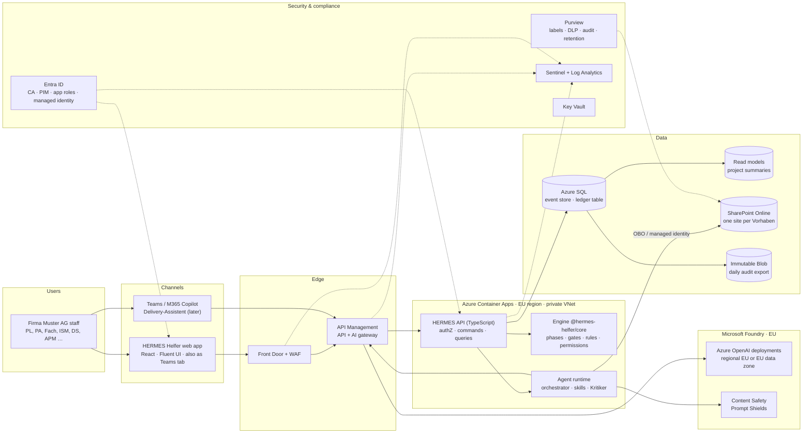
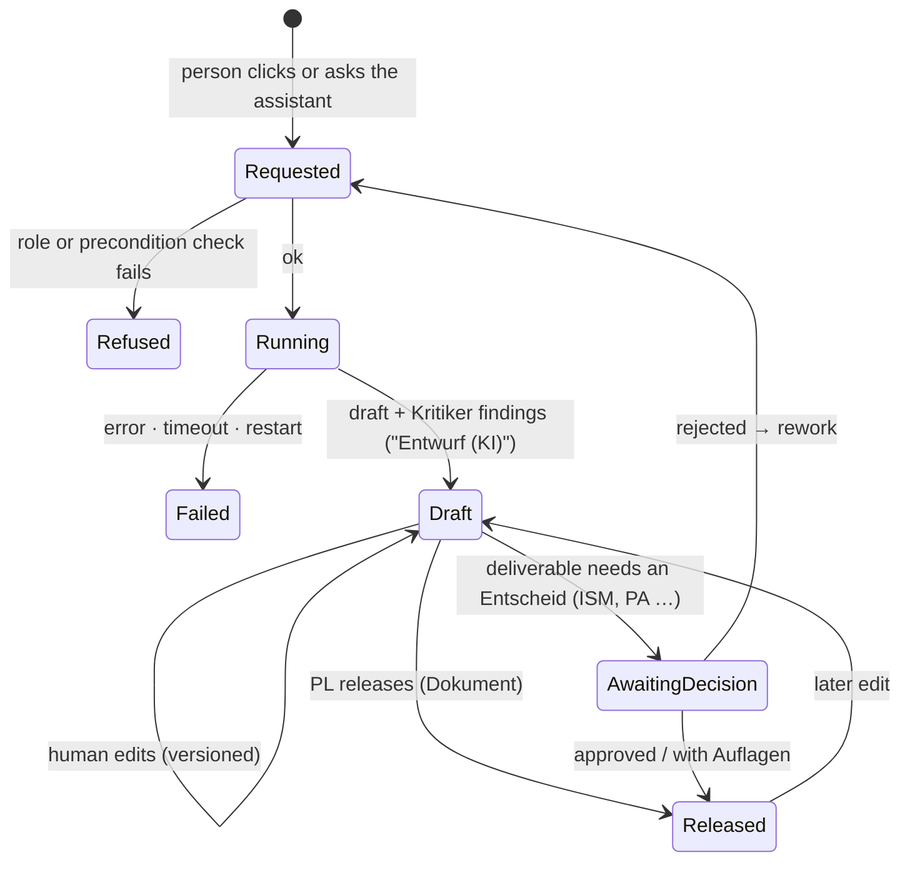

# HERMES Helfer: target architecture and agent design

| | |
|---|---|
| Status | Draft v0.5. Includes the decisions of 2026-10-08 (§1.1), the Increment 2 groundwork, the portfolio view (§7.1) and Change Requests with agent A10 (§5.5) of 2026-10-10. |
| Organisation | Firma Muster AG |
| Basis | Clickable prototype v22 (UX and domain specification) |
| Platform | Microsoft Entra ID, SharePoint Online, Microsoft 365, Azure (EU), Microsoft Foundry |
| Open questions | [`offene-fragen.md`](offene-fragen.md) (German) |
| Deferred error cases | [`todo-later.md`](todo-later.md) |

---

## 1. Summary

- **The prototype names about 60 "agents".** It has 42 phase agents, 10 background checks and 8 global or event agents, plus a feedback agent. They fall into four kinds: rule and state logic, document drafting, reviewing and monitoring, and integrations with existing systems. The target is **a deterministic HERMES process engine, 13 AI agents with one skill per deliverable, and connectors**. The UI can keep showing the HERMES-specific names ("Pattern-Pilot", "Go-live-Check"), because those become skills of fewer agents.
- **AI drafts and humans decide, and the code enforces this.** Approving, releasing, passing a gate and marking something as not applicable are not available to agents as tools. The prototype only says so in a prompt ("Entscheide triffst du nie selbst"), which is not enough for production.
- **The Projektakte is the event log.** Every change to a project is an event in an append-only, hash-chained stream per project. The state is computed from those events, so state and audit trail cannot drift apart. That fits the decision that the app is the system of record.
- **Built for 300+ projects** (§7): project roles are managed in the app instead of ~3,000 Entra groups, there is one event stream and one SharePoint site per project, a searchable project list, and a portfolio view with key figures and drill-down into each project (§7.1).
- **Pro-code TypeScript on Azure in the EU, no Power Platform** (§4). AI processing stays in the EU. Claude is currently not available with EU processing in Microsoft Foundry, so the default models are Azure OpenAI deployments in the EU (§4.3).
- **The pilot has the orchestrator plus manually triggered agents** (§5). Every draft also passes the Kritiker. Background agents come later.
- **Logs go into three separate streams:** business audit trail, AI run audit, and security telemetry. Proposed retention periods are in §9.6.
- **The app has to pass its own Pattern-Pilot.** The 12 architecture patterns in the prototype apply to the HERMES Helfer itself. It is also a HERMES project with its own SchuBAn, ISDS-Konzept and DSFA.

### 1.1 Decisions so far

| # | Topic | Decision (2026-10-08) |
|---|---|---|
| D1 | Organisation, scale | Firma Muster AG. More than 300 projects. A cross-project overview with drill-down comes later. |
| D2 | System of record | Yes. Gate, PA and CR decisions and the Projektakte live in the app. Digital decisions with Konsent are legally sufficient. |
| D3 | Data residency | AI processing stays in the EU. |
| D4 | Licences, tools | Microsoft 365 with all features. No Power Platform: apps, flows and dashboards are written as code. |
| D5 | Build approach | Pro-code, chosen by the developer (§4.2). |
| D6 | Users | Internal users only (Entra ID, SharePoint). No external guests. |
| D7 | Pilot scope | Built step by step. The first pilot has the orchestrator and manually triggered agents. |
| D8 | Logging | The developer proposes defaults (§9.6). They need confirmation (questions F21 to F24). |
| D9 | Knowledge sources | The PM-Handbuch, templates and the pattern catalogue exist. Placeholders are used until they are delivered. |

---

## 2. What the prototype contains

| Area | What the prototype does | Where it lives in production |
|---|---|---|
| Identity and roles | Entra sign-in. Groups `SG-PRJ-<CODE>-<ROLE>` map to roles, which map to views (PL/BC, Leitung, Fach, Querschnitt). | Entra ID for sign-in and global roles. Project roles live in the app (§6). |
| Phases and deliverables | 5 phases (Skalierung is an extension), 48 deliverables (pflicht/situativ). Status runs open → Entwurf (KI) → approval/veto → done. A situational deliverable can be marked "nicht zutreffend" with a reason. | Engine |
| Gates and decisions | One gate per phase with a named decider. Outcomes: freigegeben / mit Auflagen / zurückgewiesen. PA decisions need Konsent. Auflagen have an owner and a due date. ISDS and Go-live have a veto. | Engine and decision forms |
| Beteiligung | A Vorhabensprofil with 8 attributes drives rules that make roles mandatory per phase. The gate stays closed until those roles are involved. | Engine (rules) |
| Change Requests | Register with impact in 8 dimensions and a PA decision. A CR that touches data forces a recheck of SchuBAn, ISDS and DSFA. | Built (§5.5): the engine computes the impact, agent A10 drafts, the PA decides with Konsent. Detecting new requirements in meetings comes with A9. |
| Besprechungen | Turns a transcript into decisions, tasks and open questions, and mirrors the result back to the Fachstelle | AI (Protokoll) and Microsoft Graph. Increment 4. |
| Ablage | Indexes several repositories, detects duplicates, offers "Wo finde ich …" and a contact directory | SharePoint, search, AI (Wissen) |
| Systemskizze and Pattern-Pilot | 12 patterns, deviations per project, a versioned sketch | AI (Architektur) and the pattern catalogue |
| Reifegrad | 8 artifacts × 6 maturity levels, with a target per phase | Engine |
| Go-live and Readiness | 7 go-live criteria with a veto for Fachstelle and APM. Access tests that need evidence. | Engine checklists |
| Risks, Statusbericht, Kommunikation | Risk register, HERMES status report with a 6-criterion Ampel, messages per audience | Engine data and AI drafting |
| Background checks | 10 agents that run on change or on a schedule | Mixed (Appendix A). After the pilot. |
| Delivery-Assistent | Regex intent routing, an LLM fallback over project JSON, a `start_agent` tool, Autopilot | AI orchestrator (§5.4) |
| Verlauf | Activity feed with actor and channel | User-facing view of the event log (§9) |
| Feedback | Interview with AI follow-up questions and voice input | Pilot only |

---

## 3. Design principles

1. **The engine owns the truth and the AI drafts.** Phases, deliverable status, gate state, participation rules, CR impact figures, maturity levels and go-live criteria are deterministic code.
2. **No agent can decide.** Decisions are API operations that need a human user with the right role in that project (§5.2). Agents can only create proposals: drafts, findings, task proposals and risk proposals.
3. **Interactive work runs as the user.** The orchestrator and drafting agents only see what the requesting person may see. Restricted deliverables (SchuBAn, ISDS, DSFA …) never reach the model for roles without access.
4. **Every AI output carries its provenance:** the sources, the agent and skill version, the model deployment, and the Kritiker findings. It stays "Entwurf (KI)" until a named person releases it. Editing a released result sets it back to Entwurf.
5. **Decisions name the version they refer to.** A release, an approval or an edit carries the version the person saw. If the content changed in the meantime, the API refuses (409) instead of applying the decision to unseen content. The Projektakte records the version.
6. **HERMES is configuration, not code.** Phases, deliverables, skills, rules and roles are versioned configuration. Each project is pinned to a model version (§7).
7. **Untrusted content is data, never instructions.** That covers emails, transcripts and uploaded documents (§8.2).
8. **Dogfooding.** The HERMES Helfer project runs through HERMES and through the HERMES Helfer.

---

## 4. Reference architecture and stack



### 4.1 Components

| Layer | Choice | Notes |
|---|---|---|
| UI | React SPA with Fluent UI React v9, later also as a Teams tab | Microsoft's design system, so it looks native in Microsoft 365. Ported from the prototype UX. The prototype code is not reused: it overrides functions several times and builds pages with `innerHTML`. |
| API | Node.js 24 LTS with Fastify | Serves the API and the built web app from one container (same origin, no CORS in production). Distroless image from Microsoft's registry, runs as non-root. Reads its sign-in settings for the browser at runtime, so one image serves every environment. |
| Engine | Pure TypeScript package `@hermes-helfer/core` | No I/O, fully unit-tested, shared by API and UI |
| Persistence | Event store per project on Azure SQL Database: events in an append-only ledger table, one head row per project as the concurrency token. Memory or files for local development and tests. | The ledger table adds platform-level tamper evidence on top of the app's own hash chain: nobody can change or delete events, not even the database owner, and the database digests go to immutable storage. The API reads only new events and checks each against the chain. Schema changes run as a separate migration job with its own identity; the app's identity may only read and append. |
| Read models | Project summaries for the project list and the portfolio view | One summary per project, rebuilt when the project has new events; queried with filters, sorting and paging (§7.1). In memory for now; a SQL table once the API no longer keeps all events (todo-later H16, H19). |
| Documents | SharePoint Online, one site per project (§7) | Increment 3. Until then, drafts are stored in the event store. |
| Identity | Entra ID: MSAL in the SPA, JWT validation with `jose` in the API, managed identities for Azure resources | No secrets in the browser, no API keys for the models |
| AI | Own agent runtime in the API, models via Microsoft Foundry (Azure OpenAI) in the EU | §4.3 and §5 |
| Notifications | Teams activity feed and a daily digest (later) | No Power Automate |
| CI/CD | GitHub Actions: format, typecheck, unit and API tests, the event store against SQL Server, the container image, the Bicep templates, end-to-end tests. Deployment to Azure with OIDC later. | Steps for the first deployment: [`deployment.md`](deployment.md); trying it in your own subscription: [`staging.md`](staging.md) |

### 4.2 Why this stack

| Choice | Reason |
|---|---|
| TypeScript end to end | One language for UI, API and engine. The prototype's domain logic is JavaScript and ports directly. API and UI share the types. |
| Own agent runtime instead of Foundry Agent Service | Every tool call must pass the engine's permission checks and land in the audit trail. Running the tool loop in our API keeps that in one place, testable offline with a mock provider. Foundry Agent Service stays an option for hosted tools such as SharePoint grounding. Microsoft Agent Framework is only available for .NET and Python, and the pilot does not need it. |
| Event sourcing per project | The app is the system of record (D2). With events as the source, the Projektakte is complete by construction, every decision has its context, and the later portfolio view is a read model. |
| No Power Platform | Decision D4. Everything is in Git, reviewed in pull requests and tested in CI. |

### 4.3 Models and EU processing

- **Claude is currently not an option.** In Microsoft Foundry, Claude only offers Global Standard and US Data Zone deployments. It runs on Anthropic-hosted infrastructure, with Anthropic as an independent processor. EU support is announced but has no date. Check again before each increment.
- **Default: Azure OpenAI models in the EU.** There are two variants (question F3):
  - *Regional deployment* in one EU region (for example Sweden Central). Processing stays in that region. This is the strictest option and the recommendation.
  - *Data Zone Standard (EU)*. Processing can happen anywhere within the EU Data Boundary, which according to Microsoft's current documentation can also include EFTA countries such as Norway and Switzerland. It has more capacity.
  - *Global Standard* is not allowed, because it can process data outside the EU.
- **Abuse monitoring.** By default, prompts and completions can be kept for up to 30 days for abuse review. Apply for modified abuse monitoring if that is not acceptable.
- **Route by task.** A small, fast model handles intent and classification, a strong model drafts and critiques. Model versions are pinned, and an upgrade is a release that has to pass the evaluation suite.
- **Pluggable provider.** The runtime talks to a provider interface (`mock`, `azure-openai`). Another provider can be added once it meets D3.

---

## 5. Agents

Thirteen agents. Each has many **skills**, one per deliverable or task (§5.1).

| # | Agent | Covers prototype agents | Trigger | Who decides (engine) | Pilot |
|---|---|---|---|---|---|
| A1 | **Delivery-Assistent** (orchestrator) | Delivery-Assistent, routing part of Framework | Chat | (never decides) | ✓ |
| A2 | **Projektführung & Kommunikation** | Projektgrundlagen, Kick-off, Phasenbericht, Projektabschluss, Kommunikator, Wertnachweis, Referenz | Manual (PL, BC) | PA, Auftraggeber | ✓ skills |
| A3 | **Business-Analyse** | Discovery, Anforderungen, Bewerter, Business-Analyse, Scrum-Setup, Sprint-Planer, Designer | Manual (BC, Fach) | PA (Variantenwahl, agile Entwicklung) | ✓ skills |
| A4 | **Architektur & Technik** | Pattern-Pilot, Architekt, Architekturforum, Technische Koordination, Engineer, Datenmigration, Ausmusterung | Manual (Architektur, Infrastruktur) | Architektur | ✓ skills |
| A5 | **ISDS & Datenschutz** | Datenklassifizierung, Schutzbedarf, Datenschutz, Security Engineering, ISDS, Security-Prüfer | Manual (Fach, ISM, DS) | ISM, Datenschutz (ISDS veto) | ✓ skills |
| A6 | **Recht & Beschaffung** | Legal, Beschaffung | Manual (BC, PL) | PA (Vergabe) | ✓ skills |
| A7 | **Test & Abnahme** | Test-Engineer, User Acceptance, Fachtester, Testpersona, Barrierefreiheit, Go-live-Check | Manual (Test, Fach) | PL, Auftraggeber, Fach and APM (Go-live veto) | ✓ skills |
| A8 | **Einführung & Betrieb** | Betrieb (Light), Einführungsplanung, Handbücher, Einführung, Betrieb, Rollout | Manual (APM, PL) | PA (Betriebsaufnahme) | ✓ skills |
| A9 | **Protokoll** | Protokoll | Meeting ended | Fach confirms | later |
| A10 | **Change-Request** | Change-Request | Manual (any member), later also new requirements from meetings | PA with Konsent | ✓ |
| A11 | **Kritiker** | Kritiker, Verifier, Reviewer (artifacts) | Every draft | (findings only) | ✓ |
| A12 | **Risiko** | Risk | Weekly and on events | PL accepts | later |
| A13 | **Wissen** | KnowHow, Lessons Learned, Document, Housekeeping | Questions, phase end | PMO curates | later |

Some prototype agents describe work that people do in other systems: Executer (deployments) and Integrationstest (test runs). In the pilot they are **manual skills**. The responsible person records the result (for example the release version or the test summary) instead of an AI drafting it. Integrations with the pipelines follow later.

### What is not an AI agent

| Prototype agent or feature | Production component |
|---|---|
| Hermesgate, Verifier (checklists), Framework (quality gate) | Engine: gate evaluation and checklist rules |
| Beteiligung rules, Reifegrad, Readiness, Go-live criteria, vetoes | Engine |
| Finanz (reserve), CR impact figures | Engine. A2 or A10 phrase the explanation. |
| Executer, Integrationstest | Manual skills, later integrations with CI/CD and test pipelines |
| Reviewer (pull requests) | Code review in the development platform |
| Document (filing), Housekeeping (duplicates) | SharePoint provisioning and metadata, a scheduled duplicate job |
| Jour Fixe (agent health) | Operations dashboard and weekly digest (§9.5) |
| Autopilot | Later: "Start all ready drafts" with confirmation and a cost cap. It stops at every human decision. |

### 5.1 Skills

Each deliverable becomes a configuration-defined skill. The configuration lives in `packages/core/src/model/`. Example (simplified):

```ts
{
  id: "konzept.test-engineer",
  name: "Test-Engineer",
  agent: "A7",
  mode: "ai-draft",               // or "manual"
  mayStart: ["TEST"],             // the PL may always start
  approvers: [],                  // empty: a Dokument that the PL releases
  outputDoc: "Testkonzept",
}
```

The deliverable lists the template sections the draft must contain. These are placeholders until the templates arrive. The Kritiker first checks the sections deterministically (present, not empty, no open placeholders), then checks the content.

### 5.2 Tools and permissions

| Tool | Kind | Used by |
|---|---|---|
| `projekt_ueberblick`, `naechster_schritt`, `meine_aufgaben`, `gate_status`, `lieferergebnisse`, `ergebnis_details`, `change_requests` | Read, filtered by the user's roles. Without a model, the rule-based router also explains skills. | A1 |
| `entwurf_anstossen(skill)` | Request. Runs the same permission and precondition checks as the button in the UI. | A1 |
| Draft generation | Writes a draft for one deliverable | A2 to A8, inside a run started by a person |
| Change request draft | Text and affected areas of a change request; returned to the person, stored only when they submit it | A10 |
| Critique | Writes findings for a draft | A11 |

**Never available to any agent:** release, approve, decide a gate or a change request, confirm a recheck, mark "nicht zutreffend", confirm checklist items, record participation, change roles or the profile. The API checks for a human user with the matching project role on each of these operations.

### 5.3 Run lifecycle



### 5.4 The Delivery-Assistent

- **The LLM understands the request and the engine supplies the facts.** The LLM picks a tool, the engine returns the data, and the LLM phrases the answer. Without a configured model (offline, tests), a deterministic German intent router answers the common questions ("Was ist als Nächstes?", "Meine Aufgaben", "Starte Projektgrundlagen").
- **Context filtered by role on the server.** The prototype sends the whole project to the model, whatever the viewer's role. The production assistant only sees what the person may see.
- **It requests and never executes:** starting a draft goes through the same checks as a button in the UI.

---

### 5.5 Change Requests (first feature of Increment 4)

A change to the agreed scope (HERMES: Änderungsmanagement). Ported from the prototype; the cost rate and the rules are proposals (question F31).

1. **Wish.** A member of the project describes the change in a few sentences. The **Change-Request agent (A10)** turns it into a request with five sections (Ausgangslage, Gewünschte Änderung, Begründung und Nutzen, Betroffene Abläufe und Ergebnisse, Alternativen) and says which areas it touches, each with a reason: personal data, interface, deviation from the standard product, user interface, external users. In doubt it marks personal data as touched. It never estimates effort or cost. The Kritiker checks the text against the project's released results (for example a contradiction with the variant decision). Nothing is stored yet.
2. **Submission.** The person corrects the text and the areas, enters the team's effort estimate in person-days and submits. The Projektakte records the request, marked as drafted by the agent.
3. **Impact.** The engine computes eight dimensions from the effort and the areas: budget (against the reserve the PL recorded), schedule, architecture, security and data protection, testing, training and communication, operations, acceptance. Each is rated low, medium or high (`engine/change-requests.ts`).
4. **Decision.** The Projektausschuss (role PA) decides with Konsent and a reason: approve, approve with Auflagen, or reject. Auflagen work as elsewhere (owner role, due date). The requester or the PL can withdraw an open request.
5. **Recheck.** An approved request that touches personal data opens a recheck of SchuBAn, Datenschutz-Vorabklärung, ISDS-Konzept and DSFA. ISM and Datenschutz each confirm «keine Anpassung» or «Massnahme ergänzt». Until both have confirmed, the gate of the current phase stays closed (gate criterion «Neuprüfung nach Change Request»).

The Projektausschuss gets a task per open request, ISM and Datenschutz one per pending recheck. The portfolio counts open requests and open rechecks (§7.1), and the assistant answers questions about them.

## 6. Identity and authorization

- **Sign-in:** Entra ID with Conditional Access and MFA. Internal users only (D6).
- **Global roles as Entra app roles:** `HH.User` (may use the app), `HH.PMO` (sees all projects, creates projects, manages memberships), `HH.Portfolio` (Projektportfolio-Gremium: sees all projects, decides Projektfreigabe), `HH.Admin` (technical administration, no implicit project access). These roles are assigned to a few groups and appear in the token's `roles` claim, which avoids the 200-group token limit.
- **Project roles in the app** (decision pending, question F5): `PL`, `BC`, `PA`, `FACH`, `TEST`, `ISM`, `DS`, `ARCH`, `APM`, `INFRA`. The PL (or PMO) assigns them, and every change is an event in the Projektakte. ISM and Datenschutz are separate roles because they decide separately (question F6). A nightly sync with Entra flags members whose account is disabled.
- **Restricted deliverables (need-to-know):** Datenklassifizierung, SchuBAn, Datenschutz-Vorabklärung, ISDS-Konzept, DSFA and the security proofs can only be read by PL, PA, ISM, DS and ARCH, plus the roles that contribute to them (for example the Fachstelle, which fills in the SchuBAn). Everyone else sees only their status.
- **Administrators:** PIM elevation with a justification, alerts on elevation, break-glass accounts. The prototype's "als andere Person anmelden" does not exist in production. Local development uses dev users, and the API refuses to start in production with dev sign-in enabled.
- **Agent identities:** a managed identity for the API. SharePoint access with `Sites.Selected`, granted per project site, never tenant-wide.

**Permission matrix (implemented in `packages/core/src/engine/permissions.ts`)**

| Action | Who |
|---|---|
| View a project | Any member, PMO, Portfolio |
| View a restricted deliverable | PL, PA, ISM, DS, ARCH, and roles that may work on it |
| Start a skill | PL, or a role in the skill's `mayStart` |
| Edit a draft | PL, or a role that may start one of the deliverable's skills |
| Release a Dokument | PL |
| Approve an "Entscheid X" | Members holding the pending approver role |
| Decide a gate | PA, plus the Portfolio role for Projektfreigabe and Skalierung |
| Mark a situational deliverable "nicht zutreffend", reactivate it | PL |
| Record participation, confirm checklist items | PL, or the item's owner role |
| Complete an Auflage | PL, or the Auflage's owner role |
| Manage members | PL, PMO |
| Verify the audit chain | PL, PMO |
| Create a project | PMO |

---

## 7. Scaling to 300+ projects

| Topic | What 300+ projects means | Design response |
|---|---|---|
| Roles | 300 projects × 10 roles would mean about 3,000 Entra groups, slow role changes through IT tickets, and tokens over the 200-group limit | Project roles in the app (audited), only four global Entra app roles (§6) |
| Documents | 300+ project sites | Automated provisioning from a site template, a hub site "Vorhaben" for navigation and search, names derived from the project code, read-only and a retention label at closure. Existing sites are linked instead of recreated (question F9). |
| Data | Every record belongs to one project, many users in parallel | One event stream per project with optimistic concurrency, so two people deciding at the same time cannot overwrite each other. Indexed by project. Paging everywhere. |
| Navigation | A drop-down with 300 entries does not work | Searchable project list "Meine Vorhaben" with filters and server-side paging (in Increment 1) |
| Portfolio view | Overview of all projects with drill-down | Built on the project summary read model: phase, gate state, mandatory progress, open decisions, overdue Auflagen, signals that call for action. PMO and Portfolio see everything, members their own projects. First version built (§7.1). |
| Model changes | Projects run for years while the HERMES model changes | Each project is pinned to a model version. Migration is an explicit, audited PMO action. |
| AI capacity and cost | Many runs around gate dates | Token quotas per project in APIM, queue-based workers that scale out, cost per project in the dashboard |
| Notifications | Approvals across many projects | Teams activity feed and a daily digest instead of one mail per event |
| Audit volume | Millions of events over the years | Partitioning per year, a daily export to WORM storage, and a verification job per project |
| Support | About 300 project leads | In-app help, the assistant, a PMO support channel, training |

### 7.1 Portfolio view (first version)

The page «Portfolio» answers two questions for the PMO and the Portfolio-Gremium: where does a project need attention, and where are the projects in HERMES? A click on a tile or on a number in the phase table filters the list to the projects behind it, and each project opens with one click (drill-down). The filters are part of the address, so a filtered view can be shared, and «back» from a project returns to it.

| Part | Content |
|---|---|
| Handlungsbedarf | One tile per signal (below) with the number of projects. A click filters the list to exactly these projects. |
| Phase and gate | Active projects per phase, split by the state of the phase's gate: open, blocked (veto), ready for the decision. |
| Decisions and Auflagen | Open decisions on results, gates waiting for the Portfolio-Gremium (Projektfreigabe, Skalierungsentscheid), open and overdue Auflagen, finished projects. |
| Project list | Search, filters (phase, gate state, signal), sorting («Dringendste zuerst», last change, name), paging. |

**Signals** (engine, `packages/core/src/engine/portfolio.ts`). The thresholds are proposals (question F29).

| Signal | Rule | Level |
|---|---|---|
| Veto offen | A veto decision on a mandatory result (ISDS, Go-live …) is pending, so the gate is blocked | high |
| Auflagen überfällig | An Auflage is still open after its due date | high |
| Gate zurückgewiesen | The last gate decision of the current phase was a rejection | medium |
| Rollen unbesetzt | A role that decides in the current phase is held by nobody | medium |
| Neuprüfung offen | An approved change request touches personal data; SchuBAn, ISDS and DSFA are checked again and the gate stays closed | medium |
| Ohne Aktivität | No new event in the Projektakte for 30 days | medium |
| Change Request offen | A change request waits for the Projektausschuss | info |
| Gate-Entscheid fällig | All gate criteria are met; the gate waits for its decision | info |

**Due dates of Auflagen** (`engine/conditions.ts`, question F30). A decision «mit Auflagen» names one of three options. «1 Woche» and «2 Wochen» count from the decision. «bis zum nächsten Gate» is due at the gate of the following phase for a gate decision, and at the gate of the same phase for a decision on a result; it is overdue once that gate is passed. The project page shows the date and marks overdue Auflagen.

**Who sees what.** PMO and Portfolio-Gremium see all projects, everyone else the projects in which they hold a role (same rule as the project list). The figures are per project, never per person: there is no evaluation, filter or ranking by project lead (§9.6, question F23).

**How it is computed.** The engine builds one summary per project from its state. The summary depends neither on the viewer nor on the clock, so the API keeps one per project version and rebuilds it only when new events arrive. The viewer's roles and the current time (overdue, inactivity) are applied per request. Measured locally with 300 synthetic projects: about 50 ms for the first request after a start, 2 to 3 ms afterwards. API: `GET /api/portfolio?scope=all|mine` for the key figures, `GET /api/projects` with `gate`, `signal` and `sort` for the list.

**Not yet included:** trends over time, export (Excel), a weekly digest in Teams (F15), budget, dates and resources from portfolio planning (F11), the status report traffic light.

---

## 8. Security architecture

### 8.1 Controls

| Domain | Controls |
|---|---|
| Network | Front Door with WAF (start in monitoring mode), APIM in front of the API and the models, private endpoints for SQL, Storage, Foundry and Key Vault |
| Identity | Conditional Access (MFA, compliant device), PIM, managed identities, Key Vault, no API keys |
| Data classification | The project's Datenklassifizierung decides which skills and deployments may process which content. Sensitivity labels on SharePoint libraries. Purview DLP. |
| Residency | All Azure resources in an EU region. Models as in §4.3. |
| Records | Decision records exported as PDF to the project site with a Purview record label (Increment 3) |
| Application security | Threat model, dependency and secret scanning in CI, strict CSP, no HTML rendering of model output (the UI renders text only), input validation on every endpoint, rate limits per user, external pentest before go-live |
| Accessibility | WCAG 2.1 AA, using accessible Fluent UI components |

### 8.2 AI-specific threats (OWASP Top 10 for LLM applications)

| Threat | Mitigation |
|---|---|
| Indirect prompt injection (documents, transcripts) | Prompt Shields on retrieved content, untrusted content marked as data in the prompt, no write tools outside the drafts |
| Excessive agency | Tool allowlist per agent, decision operations never exposed, every run started by a person in the pilot |
| Disclosure of sensitive information | Server-side, role-filtered context. Restricted deliverables only for permitted roles. |
| Hallucination | Structured output against the template, mandatory sources (once SharePoint is connected), Kritiker, human release |
| Insecure output handling | Model output is rendered as text, never as HTML, and external links are not loaded automatically |
| Unbounded consumption | Rate limits, maximum steps per run, timeouts, later token quotas in APIM |
| Supply chain | Pinned model versions, prompts and skills in Git, evaluation gate before deploying |

---

## 9. Logging, audit and monitoring

### 9.1 Three streams

| Stream | Contents | Store |
|---|---|---|
| **1. Projektakte** | All project events: runs, drafts, edits, releases, approvals with reasons, gate decisions with Konsent and Auflagen, "nicht zutreffend", participation, checklist confirmations, membership changes | Event store with a hash chain (pilot). Later Azure SQL ledger table, daily export to WORM storage, decision PDFs as records. |
| **2. AI run audit** | Per run: who, which skill and version, model deployment, sizes, tokens, duration, outcome, Kritiker findings | Structured `ai_run` log entries (to Log Analytics), and the metrics `hh.ai_run.duration` and `hh.ai_run.tokens` in Application Insights via OpenTelemetry, without people or projects. Prompt content later in a separate store (§9.6). |
| **3. Security and platform telemetry** | Entra sign-in and audit logs, Microsoft 365 audit log, Azure activity, APIM, WAF, Key Vault, PIM, Defender | Microsoft Sentinel |

The **Verlauf** page shows stream 1 in plain German, and the integrity check verifies the hash chain on request.

### 9.2 Event example

```json
{
  "projectId": "p-crm",
  "seq": 42,
  "type": "GateDecisionRecorded",
  "data": {
    "phase": "konzept",
    "decision": "mit Auflagen",
    "reason": "…",
    "konsent": true,
    "conditions": [{ "id": "…", "text": "…", "ownerRole": "ISM", "due": "bis zum nächsten Gate" }]
  },
  "actor": { "userId": "<entra oid>", "displayName": "…", "roles": ["PA"], "channel": "web" },
  "at": "2026-10-08T14:03:11.000Z",
  "correlationId": "c-7f3e…",
  "prevHash": "9c1e…",
  "hash": "41ab…"
}
```

### 9.3 Correlation

Every request carries an `x-correlation-id`. It is stored on the events and the `ai_run` log entries. With it you can trace a decision back to the request, the run and the person.

### 9.4 Detection rules (Sentinel, Increment 2 onwards)

1. Prompt Shields detects an attack in a document. Quarantine the document and alert ISM.
2. Someone repeatedly attempts a decision without the matching role (the API blocks it, but the attempts are a signal).
3. Token usage per project deviates strongly from its baseline.
4. PIM elevation followed by a change to the HERMES configuration, the permission model or a content filter.
5. A model deployment is changed or a content filter is disabled.
6. Mass export of a Projektakte.
7. The hash chain fails verification (daily job).
8. The API was started with dev sign-in in a non-local environment (startup guard and alert).

### 9.5 Quality dashboard (replaces "Jour Fixe")

- Per skill: share of drafts released without major edits, edit size, Kritiker findings, time from draft to release
- Per agent: failures, latency, cost
- Per project: time to gate compared with earlier projects
- A weekly digest to the PMO in Teams

### 9.6 Proposed retention and access (answer to question 8, to be confirmed in F21 to F24)

| Data | Retention | Who may read |
|---|---|---|
| Projektakte (decisions, releases, approvals, role changes) | Project lifetime plus 10 years | Project members (own project), PMO, internal audit |
| Draft versions (AI and human) | As the deliverable (project lifetime plus 10 years) | As the deliverable |
| AI run metadata | 2 years | App operations, ISM (pseudonymous: user ID, not name) |
| Prompt and response content | 90 days, encrypted, in a separate store | Only case by case with four-eyes approval (ISM and Datenschutz). Every access is logged. |
| Chat history with the assistant | 90 days | The user. The user can delete it. |
| Security telemetry | 90 days interactive, 1 year total, privileged actions 2 years | SOC, ISM |
| Technical application logs | 30 days | App operations (no content, no tokens) |

Principles:
- **Data minimization.** No prompt content in technical logs, IDs instead of names.
- **Purpose limitation.** Traceability, security and quality, not staff performance. There are no per-person evaluations; the portfolio view counts per project and offers no evaluation by project lead (§7.1).
- **Transparency.** Users are informed, and AI content is labelled.
- **Legal check.** Depending on the location, rules on monitoring employees apply: in Switzerland Art. 26 ArGV 3, in Germany co-determination under §87 (1) no. 6 BetrVG. HR and legal confirm this, and it goes into the app's own DSFA.

---

## 10. Increments

| Increment | Scope | Status |
|---|---|---|
| **1. Local vertical slice** | Monorepo, engine with tests, API with dev sign-in and Entra token validation, event store with hash chain, manual skill runs with Kritiker (mock model), orchestrator chat, web UI: project list (300+), phase view, deliverables, decisions, gate, participation, roles, Verlauf, end-to-end tests | Done |
| 2. Azure pilot environment | Infrastructure as code (Bicep): Container Apps, Azure SQL (ledger), App Insights, private network. Entra app registrations, real sign-in, Azure OpenAI in the EU. Later in this increment: Front Door/WAF, APIM, Sentinel connection. The tool's own SchuBAn, ISDS-Konzept and DSFA. | Built and tested in CI: SQL event store, image, telemetry, templates. Deployment needs F2 to F4 and F25 to F28 |
| 3. SharePoint | Site provisioning or linking per project, drafts as .docx from templates, OBO access, sources in drafts, decision PDFs as records | Needs F9, templates |
| 4. Collaboration | Protokoll (Teams transcripts), Change Requests, Risiko, Wissen, Teams notifications | Change Requests built (§5.5). Open: Protokoll, Risiko, Wissen, Teams notifications; they need F11 to F15 |
| 5. Portfolio | Overview of all projects with drill-down, KPIs | First version built (§7.1): signals, phase and gate overview, due dates of Auflagen, filters, drill-down. Open: trends, export, Teams digest, data from portfolio planning. Needs F11, F29, F30 |

---

## 11. Open questions

All open questions are in German in [`offene-fragen.md`](offene-fragen.md).

---

## Appendix A: prototype agents mapped to target components

| Target | Prototype agents (42 phase, 10 background, 8 global) |
|---|---|
| A1 Delivery-Assistent | Delivery-Assistent, Framework (routing), Autopilot |
| A2 Projektführung & Kommunikation | Projektgrundlagen, Kick-off, Phasenbericht, Projektabschluss, Kommunikator, Wertnachweis, Referenz, Planner (text), Finanz (text) |
| A3 Business-Analyse | Discovery, Anforderungen, Bewerter, Business-Analyse, Scrum-Setup, Sprint-Planer, Designer |
| A4 Architektur & Technik | Pattern-Pilot, Architekt, Architekturforum, Technische Koordination, Engineer, Datenmigration, Ausmusterung |
| A5 ISDS & Datenschutz | Datenklassifizierung, Schutzbedarf, Datenschutz, Security Engineering, ISDS, Security-Prüfer |
| A6 Recht & Beschaffung | Legal, Beschaffung |
| A7 Test & Abnahme | Test-Engineer, User Acceptance, Fachtester, Testpersona, Barrierefreiheit, Go-live-Check |
| A8 Einführung & Betrieb | Betrieb (Light), Einführungsplanung, Handbücher, Einführung, Betrieb, Rollout, Trainer |
| A9 Protokoll | Protokoll |
| A10 Change-Request | Change-Request |
| A11 Kritiker | Kritiker, Verifier (semantic part), Reviewer (artifact part) |
| A12 Risiko | Risk |
| A13 Wissen | KnowHow, Lessons Learned, Document and Housekeeping (classification) |
| Engine (no AI) | Hermesgate, Verifier (checklists), Framework (quality gate), Finanz (reserve), Beteiligung rules, Reifegrad, Readiness, Go-live criteria and vetoes, CR impact figures |
| Manual skills (pilot), integrations (later) | Executer (release candidate), Integrationstest (test protocol) |
| Integration or platform | Reviewer (pull requests), Planner (resource planning), Document (filing), Housekeeping (duplicate job), Jour Fixe (dashboard) |
| Pilot only | Feedback-Agent |

## Appendix B: event model

Events per project stream (`packages/core/src/engine/events.ts`):

`ProjectCreated`, `MemberRoleAssigned`, `MemberRoleRemoved`, `ProfileUpdated`, `SkillRunRequested`, `SkillRunCompleted`, `SkillRunFailed`, `DraftEdited`, `DeliverableReleased`, `SkillDecisionRecorded`, `DeliverableMarkedNotApplicable`, `DeliverableReactivated`, `ParticipationRecorded`, `ChecklistItemConfirmed`, `GateDecisionRecorded`, `ConditionCompleted`, `ChangeRequestSubmitted`, `ChangeRequestWithdrawn`, `ChangeRequestDecided`, `ChangeRecheckConfirmed`, `ChangeReserveSet`

Every event carries the actor (user ID, name, roles at that moment, channel), the timestamp, the correlation ID and the hash chain (`prevHash`, `hash`). The project state is computed by applying the events in order (`applyEvent`). That function is pure and unit-tested.
